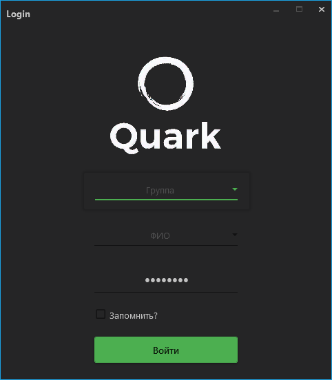

# Quark
Copy-paste permission by birth right

Данный софт разрабатывается на замену текущему софту, который используется для обучения студентов на дисциплине ООП в вузе РТУ МИРЭА.

  

Суть данного проекта заключается в решении существующих проблем в программе, которая используется на ООП на данный момент:

• **Запрет копипаста** (По факту - этот запрет не искореняет попытки списываний. Он лишь усложняет их для тех, кто списывает, а также мешает работе студенту в целом)  

• **Невозможность отправки решений непосредственно из дома** (Гипотетическая проблема. Вышла из того факта, что преподаватель может проверять работы из дома. То-есть если преподаватель может взаимодействовать с сервером из дома, то и студент может тоже)  

• **Бесполезность формы "Метод"** (Не вижу смысла в этой форме. В планах сделать автогенерацию данных этого поля в зависимости от кода)
 
• **Баги текущего софта** (Тот софт, который используется сейчас имеет баги. 2 из них я уже заметил на первых парах использования)

• **Неудобство в дизайне** (Генерировать отчет приходится по нажатию на кнопку, удержание клавиши мыши на некоторые кнопки, неудобство выбора группы и фио студента) 
